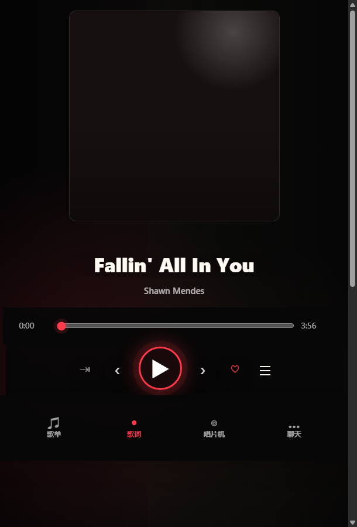

# Claudio AI Radio

本地优先的 AI 音乐播放器 / 桌面电台。

它围绕网易云歌单导入、播放队列、沉浸式歌词、聊天找歌、天气与记忆上下文、桌面版启动与服务管理做了一整套本地化体验。项目分成 Web 播放器和 Electron 桌面版两层，适合自己长期维护、长期听歌。



## 当前版本能做什么

- 导入一个或多个网易云歌单，并合并为本地曲库
- 播放全部、追加播放、下一首播放
- 顺序播放、单曲循环、随机播放
- 播放列表回撤 / 恢复
- 沉浸式歌词页与首页播放序列联动
- Chat 搜歌、按歌名 / 歌手 / 风格推荐歌曲
- 当前天气、时间、memory on 状态展示
- 收藏到自定义歌单，并识别歌曲是否已在歌单中
- 桌面歌词开关
- Electron 桌面版启动、重连本地 3000 / 4000 服务
- Windows 任务栏缩略图播放控制

## 技术结构

- `server.js`
  - 本地 Node 服务
  - 负责播放状态、队列、歌词、聊天、天气、网易云代理与持久化状态
- `public/`
  - 前端播放器界面
  - 包含首页、歌单页、沉浸式歌词页、聊天页、桌面设置弹窗
- `electron/`
  - Electron 桌面壳
  - 负责桌面启动流程、服务拉起、任务栏按钮、桌面版设置、日志桥接
- `scripts/import-netease-playlist.js`
  - 网易云歌单导入脚本
- `build/`
  - 桌面图标、任务栏控制图标、打包资源

## 运行要求

- Node.js 18+
- Windows
- 一个可用的网易云 Cookie
- 可选的 AI Key
  - `DEEPSEEK_API_KEY`
  - 或 `ANTHROPIC_API_KEY`

## 快速开始

先复制本地密钥模板：

```powershell
Copy-Item .\radio-secrets.example.ps1 .\radio-secrets.ps1
notepad .\radio-secrets.ps1
```

至少填这些变量：

```powershell
$env:NETEASE_COOKIE = ""
$env:DEEPSEEK_API_KEY = ""
```

然后启动 Web 版：

```powershell
powershell -ExecutionPolicy Bypass -File .\start-radio.ps1
```

启动后打开：

```text
http://localhost:3000
```

## 启动桌面版

桌面版命令：

```powershell
npm.cmd run desktop
```

或者直接：

```powershell
powershell -ExecutionPolicy Bypass -File .\start-desktop.ps1
```

桌面版会使用 `electron/main.cjs` 作为入口，并通过 preload 向前端暴露：

- 读取 / 保存桌面配置
- 检查 3000 / 4000 服务状态
- 刷新并重连服务
- 导入旧数据
- 创建网易云扫码登录

## 网易云 API

项目默认读取：

```text
http://localhost:4000
```

推荐准备一个兼容的 NeteaseCloudMusicAPI Enhanced 实例，并运行在 `4000` 端口。

示例：

```cmd
cd C:\path\to\api-enhanced
set PORT=4000
npm.cmd start
```

## 导入网易云歌单

导入并合并到现有本地曲库：

```powershell
npm.cmd run import:netease -- 7067937840 --base http://localhost:4000 --with-url --merge
```

一次导入多个歌单：

```powershell
npm.cmd run import:netease -- 7067937840 1234567890 9876543210 --base http://localhost:4000 --with-url --merge
```

只预览，不写入：

```powershell
npm.cmd run import:netease -- 7067937840 --base http://localhost:4000 --with-url --dry-run
```

可选参数：

- `--with-url`
  - 额外拉取可播放链接
- `--merge`
  - 与现有 `data/playlists.json` 合并
- `--dry-run`
  - 只读取，不落盘
- `--level standard|higher|exhigh|lossless|hires`
  - 指定拉取音质
- `--out <path>`
  - 指定导出路径

导入脚本会按歌曲标题和歌手做去重，并保留歌曲来自哪些歌单的信息。

## 桌面版能力

当前桌面版除了嵌入播放器，还额外支持：

- 启动加载页与进度反馈
- 桌面服务状态检测
- 设置弹窗里一键“刷新并重连”
- 任务栏缩略图上的上一首 / 播放暂停 / 下一首
- 桌面歌词窗口开关
- 本地桌面日志
- 旧版本数据导入

## 当前播放器特性

### 1. 首页

- 显示歌单墙
- 显示当前播放序列
- 显示天气、时间、memory on
- 首页队列与主播放状态联动

### 2. 歌单页

- 支持歌曲 / 歌手 / 专辑搜索
- 支持大列表分页
- 支持回撤 / 恢复播放列表
- 支持单曲播放、下一首播放、批量播放

### 3. 沉浸式歌词页

- 大屏歌词模式
- 封面倒影效果
- 歌词与播放列表联动
- 从歌词页直接开关队列

### 4. 聊天页

- 自然语言搜歌
- 标题匹配、歌手匹配、相似风格推荐
- 可结合当前天气和记忆上下文回答
- 推荐结果可继续转为播放操作

### 5. 收藏 / 自定义歌单

- 当前歌曲可直接加入自定义歌单
- 收藏菜单会识别歌曲是否已在歌单中
- 已存在歌单会显示已添加状态

## 常用脚本

```powershell
# 开发启动
npm.cmd run dev

# 桌面版
npm.cmd run desktop

# 打包桌面版
npm.cmd run desktop:pack

# 导入网易云歌单
npm.cmd run import:netease -- <playlistId...>
```

## 打包桌面版

当前配置使用 `electron-builder` 打 Windows portable 包：

```powershell
npm.cmd run desktop:pack
```

产物会输出到：

```text
dist\
```

## 本地配置

`radio-secrets.ps1` 只保留在本地，不要提交。

常用变量：

```powershell
$env:NETEASE_COOKIE = ""
$env:DEEPSEEK_API_KEY = ""
$env:DEEPSEEK_MODEL = "deepseek-chat"
$env:NETEASE_API_BASE = "http://localhost:4000"
$env:NETEASE_AUDIO_LEVEL = "standard"
```

可选变量：

```powershell
$env:OPENWEATHER_API_KEY = ""
$env:CITY = "Shanghai"
$env:ANTHROPIC_API_KEY = ""
$env:CLAUDE_MODEL = "claude-sonnet-4-20250514"
```

## 隐私与发布建议

这个项目是本地优先应用，发布源码前建议至少检查：

- `radio-secrets.ps1`
- `data/`
- 各类 `*.log`
- 临时截图、恢复文件、缓存文件
- 本地网易云 Cookie

建议忽略：

```text
radio-secrets.ps1
data/
*.log
node_modules/
dist/
```

发布前可以快速扫描明显敏感信息：

```powershell
rg "MUSIC_U|MUSIC_A_T|MUSIC_R_T|__csrf|sk-[A-Za-z0-9]" .
```

## 适合继续整理的方向

- 把播放状态链路继续收敛成单一主链
- 继续减少前端样式覆盖层数
- 把 README 截图单独整理进 `docs/` 或 `assets/`
- 为播放队列和聊天推荐补更稳定的集成测试
